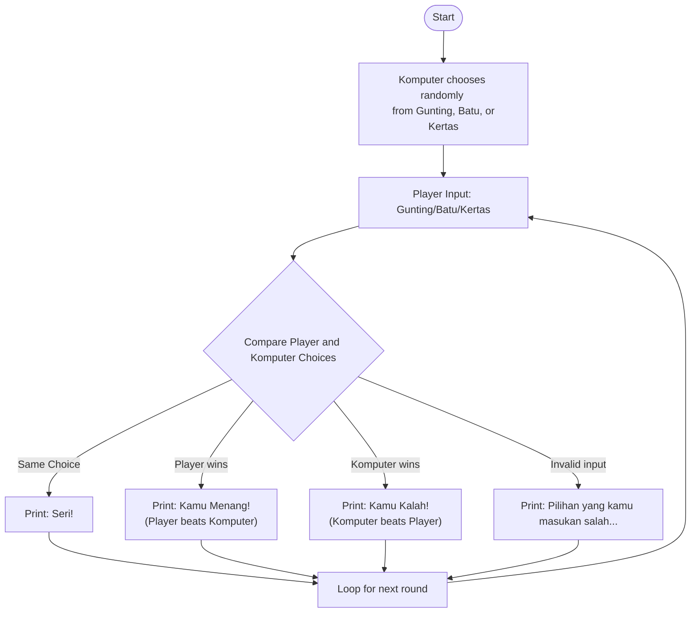

# Architecture Overview

Below is an architecture overview of the Rock-Paper-Scissors game logic shown in `main.py`, visualized using a Mermaid flowchart. This diagram illustrates the flow from player input to game result determination.

**Legend:**
- _Player Input_: Player selects "Gunting" (Scissors), "Batu" (Rock), or "Kertas" (Paper)
- _Komputer_: Computer selects randomly from the same options
- _Comparison_: Determines if the game is a draw, win, or loss
- _Loop_: Continues the game for multiple rounds
